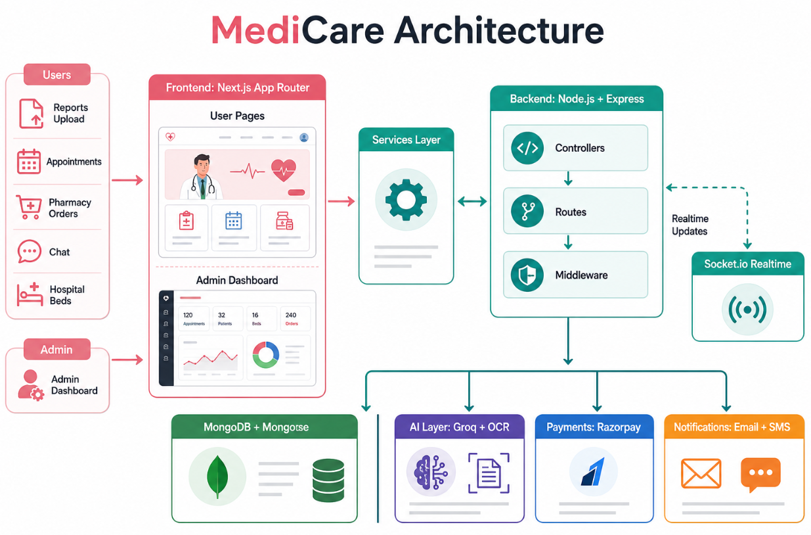
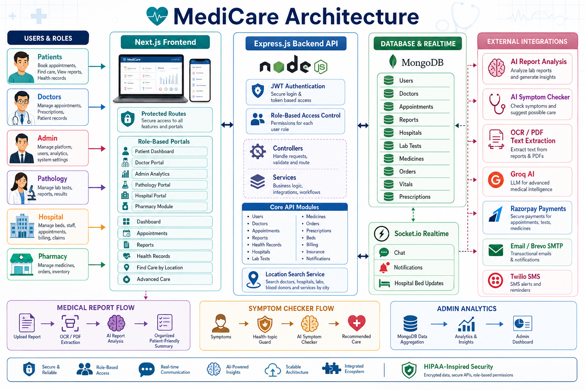

# MediCare

MediCare is a full-stack healthcare management platform built with **Next.js**, **Express.js**, **MongoDB**, **Socket.io**, and AI-assisted healthcare workflows. It brings patient services, doctor workflows, pathology operations, hospital bed management, pharmacy ordering, health records, and admin analytics into one role-based system.

The project is designed as a practical healthcare portal where each user type gets only the pages and functionality they are allowed to access.





## Project Documentation

For a more structured understanding of the project, use these docs:

| Document | Purpose |
| --- | --- |
| [Project Structure](./docs/PROJECT_STRUCTURE.md) | Explains folders, ownership, roles, and feature locations |
| [Architecture](./docs/ARCHITECTURE.md) | Explains frontend, backend, database, realtime, and AI flow |
| [Feature Map](./docs/FEATURES.md) | Lists features by patient, admin, doctor, hospital, pathology, and pharmacy |
| [API Overview](./docs/API_OVERVIEW.md) | Groups backend APIs and protected route areas |
| [Development Runbook](./docs/RUNBOOK.md) | Setup, run, verify, debug, and presentation steps |

## What The Project Does

MediCare helps patients find and manage healthcare services from one place.

Patients can:

- Search doctors, hospitals, labs, blood donors, and services by location.
- Book doctor appointments.
- Track vitals, vaccinations, prescriptions, medicine reminders, care plans, and family health records.
- Order medicines from the pharmacy module.
- View hospital bed availability.
- Chat and receive realtime notifications.

Doctors can:

- Access a doctor-only portal.
- View appointment workload and patient context.
- Manage availability and appointment status.
- Create doctor notes and prescriptions.
- Request AI diagnosis suggestions.

Pathology users can:

- Access a pathology-only portal.
- Manage lab test catalog entries.
- Track lab bookings.
- Update sample collection, report status, notes, and report summaries.

Hospital users can:

- Access a hospital-only portal.
- Manage hospital profile details.
- Update total beds, occupied beds, and availability.
- Publish realtime bed availability to patients.

Admins can:

- Access an admin-only dashboard.
- View live analytics from the database.
- Manage users, doctors, medicines, orders, hospitals, staff, invoices, claims, ambulances, and departments.
- Review extracted records across lab tests, prescriptions, vitals, notifications, care plans, and other modules.

## Main Features

| Area | Features |
| --- | --- |
| Authentication | JWT login, signup, protected routes, password reset, optional 2FA settings |
| Role Access | Separate access for patient, admin, doctor, pharmacy, pathology, and hospital users |
| Patient Dashboard | Health summary, profile, vitals, medical ID, family, reminders, prescriptions |
| Doctor Portal | Doctor-only dashboard, appointments, availability, notes, prescriptions, diagnosis suggestions |
| Pathology Portal | Lab booking workflow, sample/report updates, lab test catalog management |
| Hospital Portal | Hospital profile, bed tracking, realtime availability updates |
| Pharmacy | Medicine listing, cart/order flow, inventory and order management for pharmacy staff |
| Admin Analytics | Database-backed analytics and management views |
| Location Search | Find doctors, hospitals, lab tests, blood donors, and services by city/location |
| Realtime | Socket.io chat, notifications, and hospital bed updates |
| Payments | Razorpay payment order and verification support |
| Communication | Email support through SMTP/Resend/SendGrid and optional Twilio SMS |

## Tech Stack

### Frontend

- Next.js App Router
- React
- CSS modules and custom global styles
- Axios service layer
- Socket.io client
- React Hot Toast

### Backend

- Node.js
- Express.js
- MongoDB with Mongoose
- Socket.io
- JWT authentication
- Multer file uploads
- Tesseract.js and pdf-parse for prescription extraction
- Groq API for AI-powered suggestions and prescription analysis
- Razorpay integration
- Nodemailer, Resend, SendGrid, and Twilio support

## System Architecture

```text
Users
  |-- Patients
  |-- Admin
  |-- Doctors
  |-- Pharmacy Staff
  |-- Pathology Staff
  |-- Hospital Staff
        |
        v
Next.js Frontend
  |-- Public pages
  |-- Protected patient pages
  |-- Role-based portals
  |-- API service layer
        |
        v
Express.js Backend API
  |-- Auth middleware
  |-- Role-based middleware
  |-- Controllers
  |-- Services
  |-- File upload handling
  |-- Socket.io realtime events
        |
        v
MongoDB Database
  |-- Users
  |-- Doctors
  |-- Appointments
  |-- Hospitals
  |-- Lab tests and bookings
  |-- Medicines and orders
  |-- Health records
  |-- Notifications
 
```

## Role-Based Access

MediCare uses JWT authentication and role checks on both the frontend and backend.

| Role | Main Page | Access |
| --- | --- | --- |
| `user` | `/dashboard` | Patient health services |
| `admin` | `/admin` | Admin dashboard and management |
| `doctor` | `/doctor` | Doctor portal |
| `pharmacy` | `/pharmacy` | Pharmacy inventory and orders |
| `pathology` | `/pathology` | Pathology booking and test management |
| `hospital` | `/hospital-portal` | Hospital profile and bed management |

Backend role middleware protects sensitive APIs so users cannot access pages or data outside their role.

## Project Structure

```text
.
|-- backend/
|   |-- config/          # Database and app configuration
|   |-- controllers/     # Request handlers and business logic
|   |-- jobs/            # Scheduled/background jobs
|   |-- middleware/      # Auth, role, and upload middleware
|   |-- models/          # Mongoose schemas
|   |-- routes/          # Express API routes
|   |-- services/        # Integrations and reusable services
|   |-- uploads/         # Uploaded prescription files
|   |-- utils/           # Helpers
|   `-- server.js        # Express + Socket.io entry point
|
|-- frontend/
|   |-- public/          # Static assets
|   `-- src/
|       |-- app/         # Next.js routes and pages
|       |-- components/  # Shared UI components
|       |-- services/    # Frontend API clients
|       |-- styles/      # Page and component styles
|       `-- utils/       # Frontend helpers
|
|-- assets/              # Project images and architecture visuals
|-- ENV_SETUP.md
`-- README.md
```

## Important Frontend Pages

| Page | Purpose |
| --- | --- |
| `/` | Landing/home page |
| `/login` | User login |
| `/signup` | Account creation for patient, doctor, pharmacy, pathology, hospital, or admin |
| `/dashboard` | Patient dashboard |
| `/profile` | User profile |
| `/health` | Health summary |
| `/find-care` | Find hospitals, doctors, labs, blood donors, and services by location |
| `/doctors` | Browse doctors |
| `/booking` | Appointment booking |
| `/lab-tests` | Browse and book lab tests |
| `/hospital` | Hospital bed availability |
| `/pharmacy` | Medicine ordering and pharmacy management |
| `/doctor` | Doctor-only portal |
| `/pathology` | Pathology-only portal |
| `/hospital-portal` | Hospital-only portal |
| `/admin` | Admin-only analytics and management |

## Backend API Areas

| API Area | Base Route |
| --- | --- |
| Auth | `/api/auth` |
| Dashboard | `/api/dashboard` |
| Admin | `/api/admin` |
| Doctors | `/api/doctors` |
| Doctor Portal | `/api/doctor-portal` |
| Appointments | `/api/appointments` |
| Lab Tests | `/api/lab-tests` |
| Hospitals | `/api/hospital` |
| Pharmacy | `/api/pharmacy` |
| Medical Profile | `/api/medical-profile` |
| Vitals | `/api/vitals` |
| Vaccinations | `/api/vaccinations` |
| Care Plans | `/api/care-plans` |
| Reminders | `/api/reminders` |
| Notifications | `/api/notifications` |
| Chat | `/api/chat` |
| AI | `/api/ai` |
| Payments | `/api/payment` |

## Getting Started

### Prerequisites

- Node.js 20.x
- npm
- MongoDB running locally or a MongoDB Atlas connection string

### 1. Install Dependencies

Install backend dependencies:

```bash
cd backend
npm install
```

Install frontend dependencies:

```bash
cd ../frontend
npm install
```

### 2. Configure Environment Variables

Create `backend/.env` from `backend/.env.example`:

```powershell
cd backend
Copy-Item .env.example .env
```

Minimum backend values for local development:

```env
PORT=5000
NODE_ENV=development
MONGO_URI=mongodb://127.0.0.1:27017/medicare
JWT_SECRET=replace_with_a_long_random_secret
RECORD_ENCRYPTION_KEY=replace_with_a_long_random_encryption_key
FRONTEND_URL=http://localhost:3000
CLIENT_URL=http://localhost:3000
```

